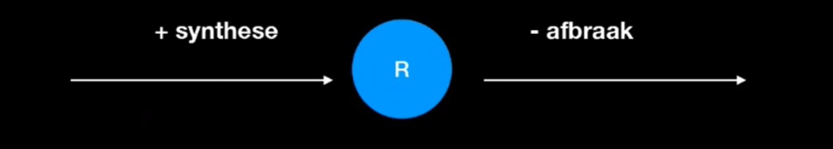

```{r setup, include=FALSE}
knitr::opts_chunk$set(echo = TRUE)
```


# Introduction

Ons onderzoek is een dynamisch mRNA synthese model. De volgende relevante zaken worden behandelt;

- Welke parameters moeten er geprogrammeerd worden?
- Er moeten internet bronnen gevonden worden waar de formule dR/dt = -rR + m vandaan komt.
- We moeten een biologisch model ontwerpen en we leggen de formule door middel van een vertaling uit.
- Achterhalen wat de return waarde van de model functie in R is, daarna deze verder toelichten (waarom we deze returnen en niet R zelf).

## Goal

Het onderzoeksdoel is om een dynamisch mRNA proces te modelleren door te programmeren en visualiseren in R met behulp van simulaties.
De onderzoekshypothese luidt; naarmate de r groter wordt (hellingsgetal) zal de uitkomst van de vergelijking dR/dt = -rR + m groter worden (dus dR/dt wordt groter).

## Theory

De tijdelijke dynamica van geactiveerde mRNA transcriptie is beschreven door de code die te vinden is onder Methods.

In dit onderzoek worden de parameters R en m geprogrammeerd van het model gemodelleerd, omdat deze variabel per tijdseenheid zijn. Op internet is de volgende [@Donlin-Aspe2017578118] bron gebruikt die uitlegt waar de formule dR/dt = -rR + m vandaan komt.

```{r formule_uitleg_bron}

```

```{r theory, echo=FALSE}

```

$$\frac{\delta R}{\delta t} = -r * R + m $$

- R is the number of transcripts\n
- r is the rate of decay of existing transcripts\n
- m is the number of new transcripts produced per second\n
# Methods

## The software model

Voor dit onderzoek is gebruik gemaakt van package deSolve (v1.28) met bijbehorende functies zoals de functie ode (ordinary differential equation, gewoonlijke differentiaal vergelijking). met de ode functie worden er tijds afhankelijke parameters gebruikt om de differentiele vergelijkingen op te lossen.

De code bevat een functie die per tijdsstip de afgeleide bepaald, dR. Hij heeft daarvoor verschillende parameters nodig zoals, de decay per tijdseenheid en tijdslengte. ODE werkt als een soort loop, hij runt de gemaakte funcite mRNA_func per tijdsstip en returned uiteindelijk de verkregen afgeleide waarden. Dit word op het laatst geplot in een grafiek zodat ook de evenwichtstoestand zichtbaar is.

```{r methods, echo=TRUE}
# De gebruikte library:
library(deSolve)

#### De gebruikte code #####################

############################################

parameters <- c(r = 0.1, m = 150) 

# Functie met de volgende parameters:
#   - t = Tijdslengte
#   - R = Het aantal transcripten
#   - parms = De "rate of decay" en het aantal nieuwe transcripten per tijdseenheid.

# Deze functie berekent de dR per tijdseenheid en returned deze in een lijst.
mRNA_func <- function(t, R, parms){
  with(as.list(c(parms)),{
         dR <- -r * R + m
         return(list(c(dR)))
       }
       )
}

# We maken een tijdslengte van t = 0 tot t = 100.
t <- seq(0, 100)

# De beginwaarde van R is 100 transcripten
state <- c(R = 100)

# Run de "ode" functie die met bepaalde parameters een model kan weergeven
# En sla dit op in out
out <- deSolve::ode(times = t, y = state, parms = parameters, func = mRNA_func, method = "euler")
# Plot de verkregen values uit out.
plot(out, main = "mRNA model", xlab = "Tijdsstip", ylab = "Aantal transcripten")

max_value <- max(out)
abline(h = max_value, col = "red", lty = 2)
cat("Max Value :", max_value)
```

De return waarde van de functie mRNA_func geeft per tijdsstip de afgeleide terug ingepakt in een list omdat de functie ode van deSolve een list nodig heeft als input. Wij returnen dit zelf omdat we niet willen dat de ode functie vaker loopt dan nodig is ( want de return geeft all waarden terug, en is een soort van break uit de functie ).

## Model configuration

In de tabel hieronder staan de gekozen parameters beschreven. Er is gekozen voor een r = 0.2 omdat een klein deel van de transcripten
decay zal vertonen. De m is gesteld op 150, en de beginhoeveelheid van transcripten op 100, een mooi rond getal.

\begin{longtable}[l]{l|l|l}
\caption{Parameter Values} \\ \hline
\label{param_table}
$\textbf{Parameter}$             &$\textbf{Value}$& $\textbf{Unit}$              \\ \hline
\endhead
$r$       & 0.2  & $Aantal\ Decay's$         \\ \hline
$m$       & 150  & $Aantal\ transcripten\ per\ tijdseenheid$   \\ \hline
$R$       & 100  & $Aantal\ transcripten\ bij t = 0$   \\ \hline
\end{longtable}


# Results

```{r model}
# Functie met de volgende parameters:
#   - t = Tijdslengte
#   - R = Het aantal transcripten
#   - parms = De "rate of decay" en het aantal nieuwe transcripten per tijdseenheid.

# Deze functie berekent de dR per tijdseenheid en returned deze in een lijst.
mRNA_func <- function(t, R, parms){
  with(as.list(c(parms)),{
         dR <- -r * R + m
         return(list(c(dR)))
       }
       )
}

# We maken een tijdslengte van t = 0 tot t = 100.
t <- seq(0, 30)

# De beginwaarde van R is 100 transcripten
state <- c(R = 100)

# Run de "ode" functie die met bepaalde parameters een model kan weergeven
# En sla dit op in out

# ----------------------------------------------------------------
# We gaan 3 scenarios plotten

parameters <- c(r = 0.2, m = 5) 
out_1 <- deSolve::ode(times = t, y = state, parms = parameters, func = mRNA_func, method = "euler")

parameters <- c(r = 0.1, m = 20) 
out_2 <- deSolve::ode(times = t, y = state, parms = parameters, func = mRNA_func, method = "euler")

parameters <- c(r = 0, m = 0) 
out_3 <- deSolve::ode(times = t, y = state, parms = parameters, func = mRNA_func, method = "euler")

parameters <- c(r = 0.5, m = 5) 
out_4 <- deSolve::ode(times = t, y = state, parms = parameters, func = mRNA_func, method = "euler")

# Plot de verkregen values uit out.
plot(out_1, main = "mRNA model", xlab = "Tijdsstip", ylab = "Aantal transcripten", ylim = c(0, 200))
lines(out_2, col = "green")
lines(out_3, col = "blue")
lines(out_4, col = "red")

# Add a cool legend!
par(xpd=TRUE)
legend(23, 230, legend=c("Decreasing over time", "Increasing over time", "steady-state", "test-line"),
       col=c("black", "green", "blue", "red"), lty=1, cex=0.8)

```

Het figuur  beeld 3 scenario's uit die kunnen gebeuren bij mRNA. Een stable-state, dus waarbij
het aantal transcripten gelijk blijft, een decreasing state, waarbij de transcripten in de tijd afnemen, en
een increasing state, waarbij de transcripten in de tijd toenemen. Hier bij is te zien, des te hoger de m
des te meer transcripten. Maar des te lager de r des te langer het duurt om bij de evenwichtstoestand te komen.

# Discussion and Conclusion

## Discussion

De gestelde hypothese hield in: "naarmate de r groter wordt (hellingsgetal) zal de uitkomst van de vergelijking dR/dt = -rR + m groter worden (dus dR/dt wordt groter)". Na dit getest te hebben is gebleken dat hoe groter r is, des te lager de uitkomst van dR/dt zal zijn zoals te zien is in het figuur hierboven ( de test-line ). Ook is gebleken dat hoe groter de m is des te meer transcripten gevormd worden ( wat ook logisch is als je kijkt naar de betekenis m ). Een zwakte in het onderzoek is wellicht de (incomplete/onduidelijke) uitleg bij de code en opgaven, hier zal nog naar gekeken moeten worden.

## General conclusion and perspective

Het doel was om een mRNA model te maken, dit is zeker gelukt. Er zijn 2 plotjes gecreeerd. Dit type model zou voor
veel andere doeleinden zoals geboorte- en sterftecijfers van een bevolkingsgroep of dynamische eiwit ontwikkelingen.