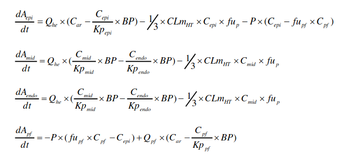

```{r setup, include=FALSE}
knitr::opts_chunk$set(echo = TRUE)
```

# Introduction
Introduction of the research and introduction research questions

The effect of plasma concentration should be related to the concentration of the test substance (so it implies the delayed ventricular regulation). The concentration of the test substance is highly effected by the extent of the delayed ventricular repolarization. Since the plasma concentration is most commonly used as the effective concentration. This research is interested in the mean concentration from drug where it meet cardiac ion channels within heart tissue.

Drug concentration in heart tissue should be of particular interest regarding all possible sites where the drug might meet cardiac ion channels.

## Goal
This research aims to give a good understanding of the drug concentration over time in different tissue types of the heart. A PBPK (physiologically-based pharmacokinetic) approach has hardly been used in the modeling of drug concentration in various locations within heart tissue so this might be a great opportunity to accelerate research into the role of drugs on many things heart related. In order to get a better understanding of this research, deSolve will be issued and model configurations should be set. In addition defined equatuions will be solved to enlarge the knowledge about the drug concentration. Therefore the Null-hypothesis; there is no significant difference between different sample groups, will be tested. If that's not the case then the alternative hypothesis is assumed to be true.

## Theory
In order to understand the model, the concept of a PBPK model needs to be clear. Simpy put, PBPK is a computer modeling approach that incorporates blood flow and tissue composition of organs to define the pharmacokinetics (PK) of drugs. Alterations in PK properties, such as, absorption, distribution, metabolism, and excretion, can have a substantial impact on achieving the desired therapeutic concentration of a drug. PBPK is a very powerful tool, so a lot of computing power is necessary. The best use for a PBPK model is drug research, which is the reason this type of model will be used in this research. It can also be, for instance, used by the Pharmaceutical Industry. The essention of integral calculations results in surface area of the graph, which is a useful application for dynamic models like the PBPK model.

The equations which are part of the heart PBPK model are as follows:
(1) - Vmax[mg/h] = Vmax_pmol x CYP x MPPGL x Wli x MW x 60 / 10^9
$${V{_m}}{_a}{_x}{_p}{_m}{_o}{_l} *CYP * MPPGL * W{_l}{_i} *MW * 60 / 10^9$$
(2) - CLu int2C8 = Cl int2C8 x fumic x ISEF2C8
$${CLU{_i}}{_n}{_t}{_2}{_C}{_2}{_8} *FU{_m}{_i}{_c} * ISEF{_2}{_c}{_8}$$
(3) - $$\frac{\frac{fu{_p}}{BP}*CLu{_i}{_n}{_t}*Q{_h}{_e}}{Q{_h}{_e}+{\frac{fu{_p}}{BP}*CLu{_i}{_n}{_t}}}$$

For the Whole-body PBPK model the Michaelis-Menten enzyme kinetics served a great factor in the composition of the first equation. This equation calculates the values of the maximal rate of saturating substrate concentrations (Vmax) in [mg/h] for each CYPs isoform. CYPs are a group of enzymes that can break down foreign substances like drugs, that is also the reason why they are part of the equation. Some parameters were obtained by using another package called the simcyp simulator. The values gotten from that prediction will be used in equation 1.

The heart model contains two equations. 
Firstly, the intrinsic clearance for each enzyme based on unbound fraction of compound will be calculated using given parameter values. To clarify, intrinsic clearance is the ability of the liver to remove drug in the absence of flow limitations and binding to cells or proteins in the blood. This is pretty important information because this process wil impact the drug concentration over time.
Secondly, The 3rd equation will calculate the total heart metabolic clearance. The importance of this value is also quite clear, because the metabolic clearance is recognized as one of the main determinants of the blood concentration as well as volume. This is therefore used to help predict toxicokinetics.

# Methods
## The software model

The tool used for this experiment is called deSolve. This is a R-package which can help solve ODE, or ordinary differential equations. A few parameters were gotten from another research which used a program called: "Simcyp Simulator" to create a PBPK model. This model can predict certain values for tissues like the Kp which is pretty useful in this case. The research talked about just now has also used a package called FME, which performs a model fit based on algorithms. Equation 4 also plays a crucial role in this step.

```{r research_code}

# Parameters to be used in the PBPK function
parameters <- c(CLuint = 10, KPmid = 7.4, Qpf = 0.01, KPendo = 14.0, KPpf = 2.6, Car = 3 / 0.0257, fup = 0.05, KPepi = 3, fupf = 0.05, P = 0.78, BP = 1.04, Qhe = 1, CLuint2C8 = 0.072, CLuint2C9 = 0.079, CLuint2J2 = 0, Vmax_pmol = 4, CYP = 10, Wli = 20.9, MW = 55.825, MPPGL = 45)

parameters_2 <- c(CLuint = 10, KPmid = 7.4, Qpf = 0.01, KPendo = 14.0, KPpf = 2.6, Car = 3 / 0.0257, fup = 0.05, KPepi = 3, fupf = 0.05, P = 0.78, BP = 1.04, Qhe = 1, CLuint2C8 = 0.072, CLuint2C9 = 0.079, CLuint2J2 = 0, Vmax_pmol = 4, CYP = 10, Wli = 20.9, MW = 55.825, MPPGL = 45)


PBPK_func <- function(t, y, parms) {
    with(as.list(c(y, parms)),{
      
      CLmHT = (((fup / BP) * CLuint * Qhe) / Qhe + (fup / BP) * CLuint)
      
      dAepi_dt <- 0.2 * (Car - (Cepi / Cpf) * BP) - 1/3 * CLmHT * Cepi * 0.05 - 0.78 * (Cepi - 0.05 * Cpf)
      
      dAmid_dt <- 0.1 * ((Cmid / KPmid) * BP - (Cendo / KPendo) * BP) - 1/3 * CLmHT * Cmid * fup
      
      dAendo_dt <- 1 * ((Cmid / KPmid) * BP - (Cendo / KPendo) * BP) - 1/3 * CLmHT * Cmid * fup
      
      dApf_dt <- -P * (fup * Cpf - Cepi) + Qpf * (Car - (Cpf / KPpf) * BP)
      
      
      
      return(list(c(dAepi_dt, dAmid_dt, dAendo_dt, dApf_dt)))
       }
       )
}

# Set initial values
state <- c(Cepi = 1, Cmid = 1, Cendo = 1, Cpf = 1)
t <- seq(0, 100, by = 1)
t_2 <- seq(100, 200, by = 1)

```

## Model configuration
The four final equations that were used to calculate the drug concentration over time can be seen in this image:

```{r deratives}

```

Each equation calculates the C (amount of drug in blood in mg/L). To get the C for each tissue type, equation 6 needs to be used. Equation 6 states that C can be calculated by dividing the volume (V) of the tissue (in L) by the amount of drugs (A) (in mg). epi stands for epicardium, mid for midmyocardium, endo for endocardium and pf for pericardial fluid. Three of the equations contain "* 1/3", this is because there are 3 tissue types so the CLmHT needs to be seperated by 3. The reason the dApf_dt is also calculated is because the Cpf value is also used in some of the other equations. Non-surprisingly the Qhe value, a.k.a. the amount of blood that passes the heart ( in L/h ), has a huge effect on the gradient of the chart because that has an effect on how fast the drug is broken down in the liver.

# Results
The structure representing the simulation of the PBPK model is shown here.
```{r}
# Use the ode function from deSolve to create a line using our created function.
# We use the method: "lsode" to get a smooth curve.
out <- deSolve::ode(times = t, y = state, parms = parameters,
                    func = PBPK_func, method = "lsoda")

out2 <- deSolve::ode(times = t_2, y=out[length(t),2:5], parms = parameters_2,
                    func = PBPK_func, method = "lsoda")


out2[,1] <- out2[,1]+t[length(t)]

out <- rbind(out,out_2)

# Make a dataframe from the data of 'out'
out <- as.data.frame(out)
plot(out$time, out$Cendo, type = "l", lwd = 3, xlim=c(0,200))
plot(out$time, out$Cmid, type = "l", lwd = 3, xlim=c(0,200))
plot(out$time, out$Cepi, type = "l", lwd = 3, xlim=c(0,200))
plot(out$time, out$Cpf, type = "l", lwd = 3, xlim=c(0,200))

out
```

# Discussion and Conclusion
## Discussion
- Compare your results with what is expecting from the literature and discuss differences with them.
- Discuss striking and surprising results.
- Discuss weaknesses in your research and how they could be addressed.
Suprisingly the first graph (The time-amount of the amitriptyline profile) resulted from fitting the model to values measured from the original report equals the first plot from the findings in this research. Although those are fits, it confirms/validates the original report in some extent, since the model is based on the equation which can be found in the chapter 'The software model'. Nevertheless some knowledge shortcomings about the library deSolve and the underlying theory inacuraccy. However, direct measurements may cause problems, and prognoses remains challenging. Because PBPK modeling makes predicting tissue concentration-time profiles possible, we rebuilt on cardiac tissue and applied a PBPK quantitative mechanistic framework to reconstructure the heart model structure.

## General conclusion and perspective
The described the development of a four-compartmental heart model has been described and its settled into a whole-body PBPK model. The model integrated literature-derived data on cardiac knolwedge and was used to predict amitriptyline concentration in venous plasma, epicardium, midmyocardium, endocardium, and pericardial fluid. The PBPK heart sub-model requires further improvement, but it represents as well as possible attempt to provide an active drug concentration in various nestings within heart tissue with the use of a PBPK approach.