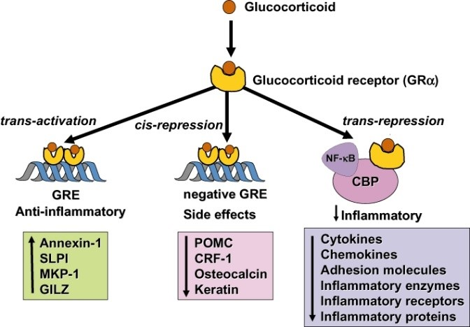
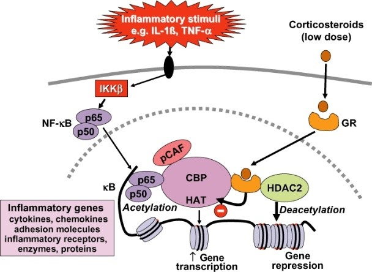

```{r setup, include=FALSE}
knitr::opts_chunk$set(echo = TRUE)
```

# Introduction
Corticosteroïden zijn chemische stoffen met een structuur die lijkt op de structuur van hormonen 
die door de bijnier worden aangemaakt. Deze bijnierhormonen, zoals bijvoorbeeld cortisol, 
spelen een rol bij ontstekingen en de afweer tegen infecties [@D].


## Goal
In dit onderzoek staat het biologisch model van het Corticoide hormoon centraal. De volgende relevante zaken worden behandelt;

- Welke parameters moeten er geprogrammeerd worden?
- Er moeten internet bronnen gevonden worden waar het biologisch model vandaan komt.
- We moeten een biologisch model ontwerpen en we leggen de formule door middel van een vertaling uit.
- Achterhalen wat de return waarde van de model functie in R is, daarna deze verder toelichten (waarom we deze returnen en niet R zelf).

## Theory
Bij een corticosteroïden behandeling wordt een medicijn (hormoon corticosteroïd) in een 
gewricht, peesschede of rond de zenuw gebracht. De corticosteroïden hebben een 
ontstekingsremmende werking en geven de geprikkelde zenuwen rust [@A].

Enkele voorbeelden van corticosteroïden zijn; Predniso(lo)n, Dexamethason, (Hydro)cortison, 
Triamcinolon, Betametason, Fluticason [@B].

De werking van corticosteroïden verschilt. Dit geldt voor sterkte, toedieningsvorm en mate van 
bijwerkingen. Het kan voorgeschreven worden als stootkuur (korte periode een hoge dosering), 
maar ook langdurig als onderhoudsbehandeling. In het geval van longpatiënten worden 
corticosteroïden gebruikt als ontstekingsremmer en worden ze ingezet bij allergische reacties op 
uitwendige prikkels (vb: hooikoorts, eczeem) [@C].

# Methods
In dit onderzoek worden de parameters R en m geprogrammeerd van het model gemodelleerd, omdat deze variabel per tijdseenheid zijn. Desolve v1.28 is gebruikt voor de visualisatie van de grafieken.

## The software model
De glucocorticoiden zullen met name meerdere ontstekings geactiveerde genen uitzetten, die 
coderen voor cytokines, chemokines, hechtings moleculen van ontstoken enzymen en receptors
(zie Fig 1). Deze genen zijn aangezet in de luchtwegen door pro-ontstekings transcriptie 
factoren, zoals nuclear factor-κB (NF-κB) en activator protein-1 (AP-1), die normaal gesproken 
beide worden geactiveerd in de buurt van asthma en COPD ontstekingen (zie Fig 2).

```{r chunk_1}


```

## Model configuration

De tijdslengte die gekozen is, is 48 uur ( omdat dit 2 dagen is en zo een onderzoeksvraag beantwoord ). Verder zijn de parameters
en values die gegeven waren via de opdracht gebruikt omdat dit feitelijke, en goed onderzochte waardes zijn. Hier in deze tabel een
overzicht van de gebruikte waardes:

\begin{longtable}[l]{l|l|l}
\caption{Parameter Values} \\ \hline
\label{param_table}
$\textbf{Parameter}$             &$\textbf{Value}$& $\textbf{Unit}$              \\ \hline
\endhead
$IC50_Rm$       & 26.2  & $fmol/mg protein$         \\ \hline
$kon$       & 0.00329  & $L/nmol/h$         \\ \hline
$kT$       & 0.63  & $1 / hour$         \\ \hline
$kre$       & 0.57  & $1 / hour$         \\ \hline
$Rf$       & 0.49  & $x$         \\ \hline
$kd_R$       & 0.0572  & $1 / hour$         \\ \hline
$kd_Rm$       & 0.612  & $x$         \\ \hline
$ks_r$       & 3.22  & $x$         \\ \hline
$D$       & 53.40868  & $nmol/L$         \\ \hline
$Rm0$       & 4.74  & $fmol/g liver$         \\ \hline
$R0$       & 267  & $fmol/mg protein$         \\ \hline
$DR$       & 0  & $fmol/mg protein$         \\ \hline
$DR(N)$       & 0  & $fmol/mg protein$         \\ \hline
\end{longtable}


# Results
De vragen die opkomen tijdens het onderzoeken van een biologisch systeem zal je kunnen beantwoorden
aan de hand van een gecreerd model. Hieronder is de code te zien dat zo'n soort model kan produceren:

```{r chunck_2}
# Change the MPL value from mol/L to nmol/L
D <- 20 * 1000 / 374.471
cat("D :", D)

# Parameters to be used in the Glucocorticoid function
parameters <- c(ks_Rm = 2.90, IC50_Rm = 26.2, kon = 0.00329,
                kT = 0.63, kre = 0.57, Rf = 0.49, kd_R = 0.0572,
                kd_Rm = 0.612, ks_r = 3.22, D, Rm0 = 4.74,
                DR = 0, DRN = 0)

# this function calculates the derivatives and returns it as a list.
Glucocorticoid_func <- function(t, y, parms) {
    with(as.list(c(y, parms)),{
      
      # Dit model bevat 4 afgeleide functies:
      # Afgeleide 1:
  
      dmRNAr_dt <- ks_Rm * ( 1 - (DRN / (IC50_Rm + DRN))) - kd_Rm * mRNAr
  
      # Afgeleide 2:
  
      dR_dt <- ks_r * mRNAr + Rf * kre * DRN - kon * D * R - kd_R * R
      
      # Afgeleide 3:
  
      dDR_dt <- kon * D * R - kT * DR
  
      # Afgeleide 4:
  
      dDRN_dt <- kT * DR - kre * DRN
      
      return(list(c(dmRNAr_dt, dR_dt, dDR_dt, dDRN_dt)))
       }
       )
}

# Set initial values
state <- c(mRNAr = 4.74, R = 267, DR = 0, DRN = 0)
t <- seq(0, 48, by = 0.1)

# Use the ode function from deSolve to create a line using our created function.
# We use the method: "lsode" to get a smooth curve.
out <- deSolve::ode(times = t, y = state, parms = parameters,
                    func = Glucocorticoid_func, method = "lsoda")

# Make a dataframe from the data of 'out'
out <- as.data.frame(out)

# Make a grid so the plotted output looks nice and organised.
par(mfrow = c(2,2) )

# Plot all the functions
plot(out$time, out$mRNAr, xlab = "Time ( in hours )", ylab = "Receptor mRNA",
     type = "l", lwd = 2, ylim = c(0,5), main= "Figure 1")

plot(out$time, out$R, xlab = "Time ( in hours )", ylab = "Free receptor density",
     type = "l", lwd = 2, ylim = c(0,300), main= "Figure 2")

plot(out$time, out$DR, xlab = "Time ( in hours )", ylab = "Drug-receoptor complex",
     type = "l", lwd = 2, ylim = c(0,50), main= "Figure 3")

plot(out$time, out$DRN, xlab = "Time ( in hours )", ylab = "Activated receptor complex",
     type = "l", lwd = 2, ylim = c(0,50), main= "Figure 4")
```
In figuur 1 is de verloop van de hoeveelheid mRNA van de receptor te zien. Opvallend is, is dat de hoeveelheid eerst sterk afneemt,
dan toeneemt en tot een evenwicht komt. Figuur 2 laat de vrije glucocorticoid receptor dichtheid in het cytosol zien. 
Hier is een snelle daling the zien na mate tijd vordert. Figuren 3 en 4 lijken best veel op elkaar als je kijkt naar het verloop,
het is in zekere mate het omgekeerde van figuur 1. Het verschil tussen figuren 3 en 4 zit hem in de locatie, want bij figuur 4
bevind het zich in de celkern en is het dus geactiveerd.

# Discussion and Conclusion
## Discussion

Uit de tekst blijkt DR (de dichtheid van het MPL-receptor complex) significant afhankelijk te zijn t.o.v. 
de andere variabelen. Deze zal het belangrijkst zijn voor de werking van het geneesmiddel, aangezien 
de transcriptie van de eigen receptoren door het medicijn MPL aan het glucocorticoid respons 
element het proces in werking stelt en behoud

## General conclusion and perspective
Discuss what your goal was, what the end result is and how you could continue working from here.

De biologische netwerken met deze parameters in deze simulatie zijn hoofdaspecten van immuun systeembiologie. Ookal is het model niet volledig nauwkeurig vergeleken met het daadwerkelijke systeem, deze is alsnog goed in staat om de intrensieke complexiteit van het immuun systeem uit te leggen.

Om het model preciezer te maken zou er meer achtergrond informatie moeten worden  opgedaan en geïmplementeerd, aangezien de theorie nu uit slechts vier bronnen plus een aangereikte bron van de vakdocent betreffen. 

Al met al is, middels het testen, en door verschillende parameters te gebruiken plus verschillende geproduceerde resultaten, het model wel significant betrouwbaar en praktisch toepasbaar voor nader onderzoek.