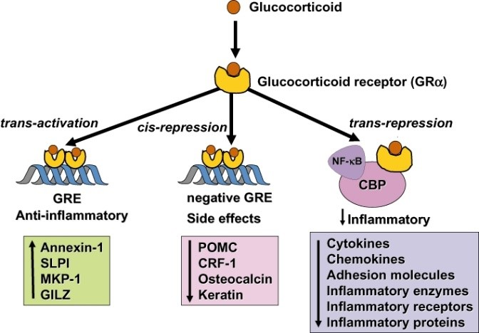
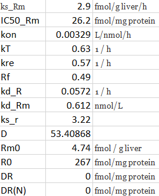

```{r setup, include=FALSE}
knitr::opts_chunk$set(echo = TRUE)
```

# Introduction
Zal een model altijd kloppen? Wanneer we de model data vergelijken met echte uitgevoerde onderzoeken met ratten kan er duidelijk gezegd worden of het model daadwerkelijk geldig is. Modellen zijn vooral handig om te kijken wat er precies gebeurd bij bepaalde scenario's, zo hoeven we ze niet in het echt uit te voeren, slechts met een simulatie. Het bewijzen van de geldigheid van het model en het visualiseren van verschillende scenario's komen in dit onderzoek aan bod.

## Goal

Het doel is nu voornamelijk om te bekijken wat er gebeurt met de grafieken als parameters verandert worden ( oftewel er moeten verschillende scenario's gerunt worden ). Ook zal de geldigheid van het model op de proef gesteld worden.

## Theory

Bij een corticosteroïden behandeling wordt een medicijn (hormoon corticosteroïd) in een 
gewricht, peesschede of rond de zenuw gebracht. De corticosteroïden hebben een 
ontstekingsremmende werking en geven de geprikkelde zenuwen rust [@A].

Enkele voorbeelden van corticosteroïden zijn; Predniso(lo)n, Dexamethason, (Hydro)cortison, 
Triamcinolon, Betametason, Fluticason [@B].

De werking van corticosteroïden verschilt. Dit geldt voor sterkte, toedieningsvorm en mate van 
bijwerkingen. Het kan voorgeschreven worden als stootkuur (korte periode een hoge dosering), 
maar ook langdurig als onderhoudsbehandeling. In het geval van longpatiënten worden 
corticosteroïden gebruikt als ontstekingsremmer en worden ze ingezet bij allergische reacties op 
uitwendige prikkels (vb: hooikoorts, eczeem) [@C].

# Methods
Over het algemeen biedt de mediaan een beter idee van de data verdeling, bij steekproefproefgemiddelden mits zij een normaal verdeling volgen. Aangezien de mediaan robuuster is dan een gemiddelde (mean), want het is minder afhankelijk van uitbijters/uitschieters, omdat het het middelste punt is van een gesorteerde reeks cijfers/getallen/gegevens en de scores niet worden gedeeld door het aantal n. Een goede illustratie zegt meer dan duizend woorden, om die reden is het beter om een grafiek van de mediaan erbij te plotten.

## The software model
De glucocorticoiden zullen met name meerdere ontstekings geactiveerde genen uitzetten, die 
coderen voor cytokines, chemokines, hechtings moleculen van ontstoken enzymen en receptors
(zie Fig 1). Deze genen zijn aangezet in de luchtwegen door pro-ontstekings transcriptie 
factoren, zoals nuclear factor-κB (NF-κB) en activator protein-1 (AP-1), die normaal gesproken 
beide worden geactiveerd in de buurt van asthma en COPD ontstekingen (zie Fig 2).

```{r chunk_1}

knitr::include_graphics('Fig2_week2.jpg')
```

## Model configuration

De configuratie ( parameters etc ) is te zien in onderstaand figuur/tabel. Let op. Bij verschillende opgaven worden andere parameters gebruikt, zoals dat D = 39 bij de onderstaande code block in de 'results' sectie.

```{r chunk_2}

```

# Results

De vragen die opkomen tijdens het onderzoeken van een biologisch systeem zal je kunnen beantwoorden
aan de hand van een gecreerd model. Hieronder is de code te zien dat zo'n soort model kan produceren:

```{r formule_modellen}
# this function calculates the derivatives and returns it as a list.
Glucocorticoid_func <- function(t, y, parms) {
    with(as.list(c(y, parms)),{
      
      # Dit model bevat 4 afgeleide functies:
      # Afgeleide 1:
  
      dmRNAr_dt <- ks_Rm * ( 1 - (DRN / (IC50_Rm + DRN))) - kd_Rm * mRNAr
  
      # Afgeleide 2:
  
      dR_dt <- ks_r * mRNAr + Rf * kre * DRN - kon * D * R - kd_R * R
      
      # Afgeleide 3:
  
      dDR_dt <- kon * D * R - kT * DR
  
      # Afgeleide 4:
  
      dDRN_dt <- kT * DR - kre * DRN
      
      return(list(c(dmRNAr_dt, dR_dt, dDR_dt, dDRN_dt)))
       }
       )
}
```

Question 1.2

```{r chunck_3}
data <- read.csv("MPL.csv", na.strings = "NA")

medians <- aggregate(data[,c("MPL_conc","mRNA","Free_receptor")],list(data$dose,data$time), median, na.rm=T)
names(medians)[1:2] <- c("dose","time")
medians_01 <- subset(medians, dose == 0.1 | dose == 0)
medians_03 <- subset(medians, dose == 0.3 | dose == 0)
```

```{r chunk_4}
par(mfrow = c(2,2) )

# Set initial values
state <- c(mRNAr = 4.74, R = 267, DR = 0, DRN = 0)
t <- seq(0, 168, by = 1)

# -----------------------------------------------
# Dose 0.1

parameters_01 <- c(ks_Rm = 2.90, IC50_Rm = 26.2, kon = 0.00329,
                kT = 0.63, kre = 0.57, Rf = 0.49, kd_R = 0.0572,
                kd_Rm = 0.612, ks_r = 3.22, D = 39.0, Rm0 = 4.74,
                DR = 0, DRN = 0)

out_01 <- deSolve::ode(times = t, y = state, parms = parameters_01,
                    func = Glucocorticoid_func, method = "lsoda")

out_01 <- as.data.frame(out_01)

plot(out_01$time, out_01$mRNAr,
     main="Receptor mRNA by dose 0.1",
     ylab=c("nmol/L"), xlab=c(" Time in hours"),
     type='l', lwd = 2, xlim= c(0,60), ylim= c(0,5))

lines(data$time, data$mRNA, type = "p")
lines(medians_01$time, medians_01$mRNA, type = "l", col= "red")

plot(out_01$time, out_01$R,
     main="Free receptor mRNA by dose 0.1",
     ylab=c("nmol/L"), xlab=c(" Time in hours"),
     type='l', lwd = 2, xlim= c(0,60), ylim= c(0,500))

lines(data$time, data$Free_receptor, type = "p")
lines(medians_01$time, medians_01$Free_receptor, type = "l", col= "red")

# -----------------------------------
# Dose 0.3

parameters_03 <- c(ks_Rm = 2.90, IC50_Rm = 26.2, kon = 0.00329,
                kT = 0.63, kre = 0.57, Rf = 0.49, kd_R = 0.0572,
                kd_Rm = 0.612, ks_r = 3.22, D = 107, Rm0 = 4.74,
                DR = 0, DRN = 0)

out_03 <- deSolve::ode(times = t, y = state, parms = parameters_03,
                    func = Glucocorticoid_func, method = "lsoda")

out_03 <- as.data.frame(out_03)

plot(out_03$time, out_03$mRNAr,
     main="Receptor mRNA by dose 0.3",
     ylab=c("nmol/L"), xlab=c(" Time in hours"),
     type='l', lwd = 2, xlim= c(0,60), ylim= c(0,5))

lines(data$time, data$mRNA, type = "p")
lines(medians_01$time, medians_01$mRNA, type = "l", col= "red")

plot(out_03$time, out_03$R,
     main="Free receptor mRNA by dose 0.3",
     ylab=c("nmol/L"), xlab=c(" Time in hours"),
     type='l', lwd = 2, xlim= c(0,60), ylim= c(0,500))

lines(data$time, data$Free_receptor, type = "p")
lines(medians_01$time, medians_01$Free_receptor, type = "l", col= "red")
```
De resultaten van het model (zwart) komen wel overeen met elkaar, aangezien de gefitte lijnen (rode experiment data) een gevolg zijn van de data observaties
(zwarte model data). Het onderlinge verschil tussen de twee model zwarte model-lijnen is
mogelijk te verklaren door het onderlinge verschil in condities van model groepen (sample groups).
Omdat een hogere drug concentratie leidt tot verhoogde kans van bindingen met mRNA receptoren
zal de concentratie mRNA bezette receptoren bij een hogere dosis (0.3 ipv 0.1) sneller afnemen
in een bepaalde tijd (zie fig Receptor mRNA by dose 0.3) dan bij een lagere dosis (zie fig Receptor mRNA by dose 0.1)
Dat verschil is af te leiden tussen de grafieken!


De tijdsverloop van het geactiveerde drug-receptor complex is afhankelijk van de auto-regulatie van de glucorticoide receptor. Hierom moet de formule die de auto-regulatie van de glucorticoide receptor variabele bevat worden aangepast, dat is de formule 'Afgeleide 1' in de code chunk 'formule_modellen'. Zie de onderstaande aangepaste functie van het model en de output daarvan.

(x+1)(x-1) = 0
Bovenstaande vergelijking is alleen waar als x = -1 of x = 1, omdat dan een van beide producten dan nul is en iets keer nul is nul.

dmRNAr_dt <- ks_Rm * ( 1 - (DRN / (IC50_Rm + DRN))) - kd_Rm * mRNAr
Wanneer er geen auto-regulatie is van de glucocorticoide receptor is, betekent het dat de uitkomst nul wordt. Dus de 'Afgeleide 1' herleiden we op nul, net als het voorbeeld van (x+1) (x-1)...

De parameter ks_Rm is afhankelijk van ( 1 - (DRN / (IC50_Rm + DRN) en wordt nul als ( 1 - (DRN / (IC50_Rm + DRN) nul is.

Dus moet de volgende vergelijking worden opgelost...
ks_Rm * ( 1 - (DRN / (IC50_Rm + DRN))) = 0
dus...
1 -1*(DRN / (IC50_Rm + DRN)) = 0
dus...
1 = +1(DRN / (IC5_Rm + DRN))
dus...
1 = (DRN / (IC5_Rm + DRN))

dus...
1 = (0 / (0 + 0)) want 0 / 0 is 1!
oplossing:
dus de parameters DRN, IC5_Rm, DRN zijn nul en de vergelijking kan dus verwijderd worden.

```{r chunk_5}
Glucocorticoid_func_2.1 <- function(t, y, parms) {
    with(as.list(c(y, parms)),{
      
      # Dit model bevat 4 afgeleide functies:
      # Afgeleide 1:
      
      dmRNAr_dt <- ks_Rm - kd_Rm * mRNAr # * (DRN / (IC5_Rm + DRN)) This has been removed to answer
                                         # the research question
  
      # Afgeleide 2:
  
      dR_dt <- ks_r * mRNAr + Rf * kre * DRN - kon * D * R - kd_R * R
      
      # Afgeleide 3:
  
      dDR_dt <- kon * D * R - kT * DR
  
      # Afgeleide 4:
  
      dDRN_dt <- kT * DR - kre * DRN
      
      return(list(c(dmRNAr_dt, dR_dt, dDR_dt, dDRN_dt)))
       }
       )
}

parameters <- c(ks_Rm = 2.90, IC50_Rm = 26.2, kon = 0.00329,
                kT = 0.63, kre = 0.57, Rf = 0.49, kd_R = 0.0572,
                kd_Rm = 0.612, ks_r = 3.22, D = 53, Rm0 = 4.74,
                DR = 0, DRN = 0)

t = seq(0, 48, by = 0.1)

out <- deSolve::ode(times = t, y = state, parms = parameters,
                    func = Glucocorticoid_func_2.1, method = "lsoda")


out <- as.data.frame(out)

par(mfrow=c(2,2))
  plot(out$time,out$mRNAr,ylim = c(0,5), xlab="Time",ylab="receptor mRNA",type="l",lwd=2)
  plot(out$time,out$R, ylim = c(100, 300), xlab="Time",ylab="free receptor density",type="l",lwd=2)
  plot(out$time,out$DR, ylim = c(0,50), xlab="Time",ylab="drug-receptor complex",type="l",lwd=2)
  plot(out$time,out$DRN, ylim = c(0,50), xlab="Time",ylab="activated receptor complex",type="l",lwd=2)
```
Omdat we de terugkoppelings reactie ( * (DRN / (IC5_Rm + DRN)) ) verwijderd hebben uit de functie ( nieuwe functie is dus Glucocorticoid_func_2.1 ) kan er geen extra receptor mRNAr aangemaakt worden. Dit is ook te zien in de figuur linksbovenin, hij blijft staan op de value 4.74. Dit zal er dus gebeuren als de drugs geen effect hadden op de synthese van mRNAr.

De D waarde heeft een groot effect op de verloop van de grafieken. Deze stelling kunnen we demonstreren aan de hand van de code hieronder. Wanneer de steady-state bereikt is ( bij ongeveer t = 48 ) veranderen we de D waarde naar 0. 

```{r chunk_6}
par(mfrow=c(2,2))
state <- c(mRNAr=4.74, R=267, DR=0, DRN=0)

# Creeer tijdsintervallen
t_1 <-seq(0, 48, by=1)
t_2 <- seq(0, 72, by=1)

# Model parameters
parameters <- c(D=20*1000/374.471, ks_Rm = 2.90, IC50_Rm = 26.2, kon = 0.00329,
                kT = 0.63, kre = 0.57, Rf = 0.49, kd_R = 0.0572,
                kd_Rm = 0.612, ks_r = 3.22, Rm0 = 4.74,
                DR = 0, DRN = 0
)

# call lsoda and store result in out
out1 <- deSolve::ode(y=state,times=t_1, func=Glucocorticoid_func, parms=parameters)

# Maak D = 0
parameters[1] <- 0

out2 <- deSolve::ode(y=out1[length(t_1),2:5], times=t_2, func=Glucocorticoid_func, parms=parameters) 

out2[,1] <- out2[,1]+t_1[length(t_1)]

out <- rbind(out1, out2)

out<-as.data.frame(out)
out$tot <- out$R + out$DR + out$DRN

plot(out$time,out$mRNAr,ylim = c(0,5), xlab="Time",ylab="receptor mRNA",type="l",lwd=2)
plot(out$time,out$R, ylim = c(0,500), xlab="Time",ylab="free receptor density",type="l",lwd=2)
plot(out$time,out$DR, ylim = c(0,50), xlab="Time",ylab="crug-receptor complex",type="l",lwd=2)
plot(out$time,out$DRN, ylim = c(0,50), xlab="Time",ylab="activated receptor complex",type="l",lwd=2)
```
Hierboven is te zien dat de D waarde inderdaad een grote invloed heeft. bij t = 48 keert elke lijn weer terug naar een nieuwe steady-state, dit is voor nu dus steady-state-second.


```{r models}
par(mfrow = c(1,2) )
t <- seq(0, 100, by = 0.1)

parameters_normal <- c(ks_Rm = 0, IC50_Rm = 26.2, kon = 0.00329,
                kT = 0.63, kre = 0.57, Rf = 0.49, kd_R = 0.0572,
                kd_Rm = 0.612, ks_r = 3.22, D = 53, Rm0 = 4.74,
                DR = 0, DRN = 0)

parameters_1 <- c(ks_Rm = 0, IC50_Rm = 26.2, kon = 0.00329/5,
                kT = 0.63, kre = 0.57, Rf = 0.49, kd_R = 0.0572,
                kd_Rm = 0.612, ks_r = 3.22, D = 53, Rm0 = 4.74,
                DR = 0, DRN = 0)

parameters_2 <- c(ks_Rm = 0, IC50_Rm = 26.2, kon = 0.00329/2,
                kT = 0.63, kre = 0.57, Rf = 0.49, kd_R = 0.0572,
                kd_Rm = 0.612, ks_r = 3.22, D = 53, Rm0 = 4.74,
                DR = 0, DRN = 0)

parameters_3 <- c(ks_Rm = 0, IC50_Rm = 26.2, kon = 0.00329*2,
                kT = 0.63, kre = 0.57, Rf = 0.49, kd_R = 0.0572,
                kd_Rm = 0.612, ks_r = 3.22, D = 53, Rm0 = 4.74,
                DR = 0, DRN = 0)

parameters_4 <- c(ks_Rm = 0, IC50_Rm = 26.2, kon = 0.00329*5,
                kT = 0.63, kre = 0.57, Rf = 0.49, kd_R = 0.0572,
                kd_Rm = 0.612, ks_r = 3.22, D = 53, Rm0 = 4.74,
                DR = 0, DRN = 0)

parameters_5 <- c(ks_Rm = 0, IC50_Rm = 26.2, kon = 0.00329,
                kT = 0.63, kre = 0.57/5, Rf = 0.49, kd_R = 0.0572,
                kd_Rm = 0.612, ks_r = 3.22, D = 53, Rm0 = 4.74,
                DR = 0, DRN = 0)

parameters_6 <- c(ks_Rm = 0, IC50_Rm = 26.2, kon = 0.00329,
                kT = 0.63, kre = 0.57/2, Rf = 0.49, kd_R = 0.0572,
                kd_Rm = 0.612, ks_r = 3.22, D = 53, Rm0 = 4.74,
                DR = 0, DRN = 0)

parameters_7 <- c(ks_Rm = 0, IC50_Rm = 26.2, kon = 0.00329,
                kT = 0.63, kre = 0.57*2, Rf = 0.49, kd_R = 0.0572,
                kd_Rm = 0.612, ks_r = 3.22, D = 53, Rm0 = 4.74,
                DR = 0, DRN = 0)

parameters_8 <- c(ks_Rm = 0, IC50_Rm = 26.2, kon = 0.00329,
                kT = 0.63, kre = 0.57*5, Rf = 0.49, kd_R = 0.0572,
                kd_Rm = 0.612, ks_r = 3.22, D = 53, Rm0 = 4.74,
                DR = 0, DRN = 0)


out_1 <- deSolve::ode(times = t, y = state, parms = parameters_1,
                    func = Glucocorticoid_func, method = "lsoda")
out_2 <- deSolve::ode(times = t, y = state, parms = parameters_2,
                    func = Glucocorticoid_func, method = "lsoda")
out_3 <- deSolve::ode(times = t, y = state, parms = parameters_3,
                    func = Glucocorticoid_func, method = "lsoda")
out_4 <- deSolve::ode(times = t, y = state, parms = parameters_4,
                    func = Glucocorticoid_func, method = "lsoda")

out_5 <- deSolve::ode(times = t, y = state, parms = parameters_5,
                    func = Glucocorticoid_func, method = "lsoda")
out_6 <- deSolve::ode(times = t, y = state, parms = parameters_6,
                    func = Glucocorticoid_func, method = "lsoda")
out_7 <- deSolve::ode(times = t, y = state, parms = parameters_7,
                    func = Glucocorticoid_func, method = "lsoda")
out_8 <- deSolve::ode(times = t, y = state, parms = parameters_8,
                    func = Glucocorticoid_func, method = "lsoda")
out <- deSolve::ode(times = t, y = state, parms = parameters_normal,
                    func = Glucocorticoid_func, method = "lsoda")

out_1 <- as.data.frame(out_1)
out_2 <- as.data.frame(out_2)
out_3 <- as.data.frame(out_3)
out_4 <- as.data.frame(out_4)
out_5 <- as.data.frame(out_1)
out_6 <- as.data.frame(out_2)
out_7 <- as.data.frame(out_3)
out_8 <- as.data.frame(out_4)
out <- as.data.frame(out)

plot(out_1$time, out_1$R, type = "l", lwd = 1, xlab = "Time in hours", ylab = "nmol/L", col = "red")
lines(out_2$time, out_2$R, col = "orange")
lines(out_3$time, out_3$R, col = "blue")
lines(out_4$time, out_4$R, col = "purple")
lines(out$time, out$R, col = "black", lwd = 2)

plot(out_5$time, out_5$R, type = "l", lwd = 1, xlab = "Time in hours", ylab = "nmol/L", col = "red")
lines(out_6$time, out_6$R, col = "orange")
lines(out_7$time, out_7$R, col = "blue")
lines(out_8$time, out_8$R, col = "purple")
lines(out$time, out$R, col = "black", lwd = 2)
```

kre is de eerste orde snelheidsconstanten voor translocatie van het MPL-receptor complex naar de nucleus en ‘recovery’ van de receptor van de celkern naar het cytosol. Aangezien kon de tweede orde snelheidsconstante voor vorming van het MPL-receptor complex betreft, is het logisch dat bij veranderingen van deze parameters de mRNA transcriptie niet beinvloedt wordt, daarnaast is dat ook te zien in het schema mrna_dynamics.

```{r chunk_7}
knitr::include_graphics("mrna_dynamics.png")
```
Hierin is duidelijk te zien dat ksr en kon pas na de mRNAr zich in het biologische proces mengt omtrent het corticoïde model.


De code hieronder genereert grafieken die een scenario uitbeelt waarbij de synthese van de receptor geblokeerd word. De parameter die hiervoor veranderd moet worden is ks_r. Dit is omdat deze waarde in de 2e afgeleide de hoeveelheid receptor regelt. Als we ks_r dus op 0 zetten maken we een situatie waarbij er geen synthese meer is van de receptor.

```{r chunk_8}
par(mfrow = c(2,2) )

parameters <- c(ks_Rm = 0, IC50_Rm = 26.2, kon = 0.00329,
                kT = 0.63, kre = 0.57, Rf = 0.49, kd_R = 0.0572,
                kd_Rm = 0.612, ks_r = 0, D = 53, Rm0 = 4.74,
                DR = 0, DRN = 0)

t = seq(0, 48, by = 0.1)

out <- deSolve::ode(times = t, y = state, parms = parameters,
                    func = Glucocorticoid_func, method = "lsoda")


out <- as.data.frame(out)

plot(out$time,out$mRNAr,ylim = c(0,5), xlab="Time",ylab="receptor mRNA",type="l",lwd=2)
plot(out$time,out$R, ylim = c(0,300), xlab="Time",ylab="free receptor density",type="l",lwd=2)
plot(out$time,out$DR, ylim = c(0,50), xlab="Time",ylab="drug-receptor complex",type="l",lwd=2)
plot(out$time,out$DRN, ylim = c(0,50), xlab="Time",ylab="activated receptor complex",type="l",lwd=2)
```
Voornamelijk in de figuren onderaan is te zien dat de drug- en activated receptor dichtheid vrij snel daalt omdat de synthese van de receptor geblokeerd is. Als je dit vergelijkt met de normale situatie is er zeker een verschil.

In dit scenario kijken we naar wat er gebeurt als we de parameters, ks_rm en kd_rm vergroten en verkleinen. We testen dit met de volgende 'fold changes': / 2, / 5, x 2 en x 5. Hier onder is de code te zien die deze situatie tot leven brengt:

```{r chunk_9}
par(mfrow = c(2,2) )
t <- seq(0, 50, by = 0.1)

parameters_1 <- c(ks_Rm = 2.90/5, IC50_Rm = 26.2, kon = 0.00329,
                kT = 0.63, kre = 0.57, Rf = 0.49, kd_R = 0.0572,
                kd_Rm = 2.9/5/4.74, ks_r = 3.22, D = 53, Rm0 = 4.74,
                DR = 0, DRN = 0)

parameters_2 <- c(ks_Rm = 2.90/2, IC50_Rm = 26.2, kon = 0.00329,
                kT = 0.63, kre = 0.57, Rf = 0.49, kd_R = 0.0572,
                kd_Rm = 2.9/2/4.74, ks_r = 3.22, D = 53, Rm0 = 4.74,
                DR = 0, DRN = 0)

parameters_3 <- c(ks_Rm = 2.90*2, IC50_Rm = 26.2, kon = 0.00329,
                kT = 0.63, kre = 0.57, Rf = 0.49, kd_R = 0.0572,
                kd_Rm = 2.9*2/4.74, ks_r = 3.22, D = 53, Rm0 = 4.74,
                DR = 0, DRN = 0)

parameters_4 <- c(ks_Rm = 2.90*5, IC50_Rm = 26.2, kon = 0.00329,
                kT = 0.63, kre = 0.57, Rf = 0.49, kd_R = 0.0572,
                kd_Rm = 2.9*5/4.74, ks_r = 3.22, D = 53, Rm0 = 4.74,
                DR = 0, DRN = 0)

out_1 <- deSolve::ode(times = t, y = state, parms = parameters_1,
                    func = Glucocorticoid_func, method = "lsoda")

out_2 <- deSolve::ode(times = t, y = state, parms = parameters_2,
                    func = Glucocorticoid_func, method = "lsoda")

out_3 <- deSolve::ode(times = t, y = state, parms = parameters_3,
                    func = Glucocorticoid_func, method = "lsoda")

out_4 <- deSolve::ode(times = t, y = state, parms = parameters_4,
                    func = Glucocorticoid_func, method = "lsoda")

out_1 <- as.data.frame(out_1)
out_2 <- as.data.frame(out_2)
out_3 <- as.data.frame(out_3)
out_4 <- as.data.frame(out_4)

plot(out_1$time, out_1$mRNAr,
     ylab=c("Receptor mRNA"), xlab=c(" Time in hours"),
     type='l', lwd = 2, xlim= c(0,50), ylim= c(5, 0))

lines(out_2$time, out_2$mRNAr, lwd = 2, col = "red")
lines(out_3$time, out_3$mRNAr, lwd = 2, col = "blue")
lines(out_4$time, out_4$mRNAr, lwd = 2, col = "purple")

plot(out_1$time, out_1$R,
     ylab=c("Free receptor density"), xlab=c(" Time in hours"),
     type='l', lwd = 2, xlim= c(0,50), ylim= c(0, 400))

lines(out_2$time, out_2$R, lwd = 2, col = "red")
lines(out_3$time, out_3$R, lwd = 2, col = "blue")
lines(out_4$time, out_4$R, lwd = 2, col = "purple")

plot(out_1$time, out_1$DR,
     ylab=c("Drug-receoptor complex"), xlab=c(" Time in hours"),
     type='l', lwd = 2, xlim= c(0,50), ylim= c(50, -50))

lines(out_2$time, out_2$DR, lwd = 2, col = "red")
lines(out_3$time, out_3$DR, lwd = 2, col = "blue")
lines(out_4$time, out_4$DR, lwd = 2, col = "purple")

plot(out_1$time, out_1$DRN,
     ylab=c("Activated receptor complex"), xlab=c(" Time in hours"),
     type='l', lwd = 2, xlim= c(0,50), ylim= c(50, -50))

lines(out_2$time, out_2$DRN, lwd = 2, col = "red")
lines(out_3$time, out_3$DRN, lwd = 2, col = "blue")
lines(out_4$time, out_4$DRN, lwd = 2, col = "purple")
```
In de plotjes hierboven is vooral bij de figuur linksboven een duidelijk verschil te zien tussen de fold changes. Dus de receptor mRNA hangt het meest af van de ks_rm & kd_rm parameters af in vergelijking met de andere figuren. De kleuren duiden de hoeveelheid change aan: zwart = x 5, rood = x 2, blauw = / 2 en paars is / 5.

# Discussion and Conclusion
## Discussion
- Compare your results with what is expecting from the literature and discuss differences with them.

Vergeleken met de literaire resultaten zijn er veel overeenkomsten. Enige verschillen zijn de gegevens (cijfers) uit dit verslag t.o.v. de steekproefgegevens uit de voorbeelden. Waardoor de prognoses (modellen en grafieken) verschillen met de originele cijfers

Om het model preciezer te maken zou er meer achtergrond informatie moeten worden  opgedaan en geïmplementeerd, aangezien de theorie nu uit slechts vier bronnen plus een aangereikte bron van de vakdocent betreffen. 

Al met al is, middels het testen, en door verschillende parameters te gebruiken plus verschillende geproduceerde resultaten, het model wel significant betrouwbaar en praktisch toepasbaar voor nader onderzoek.

## General conclusion and perspective
Het doel van deze opdracht was uitbouwen op de eigen-implementatie van het corticoide model, door additionele simulaties uit te voeren. Om deze tot slot in detail te vergelijken met andere resultaten. Vanuit deze progressie is het belangrijk om de onderzoeksresultaten te valideren, dat zal gebeuren in de volgende opdracht. Waar we 'peer reviiews' zullen houden.